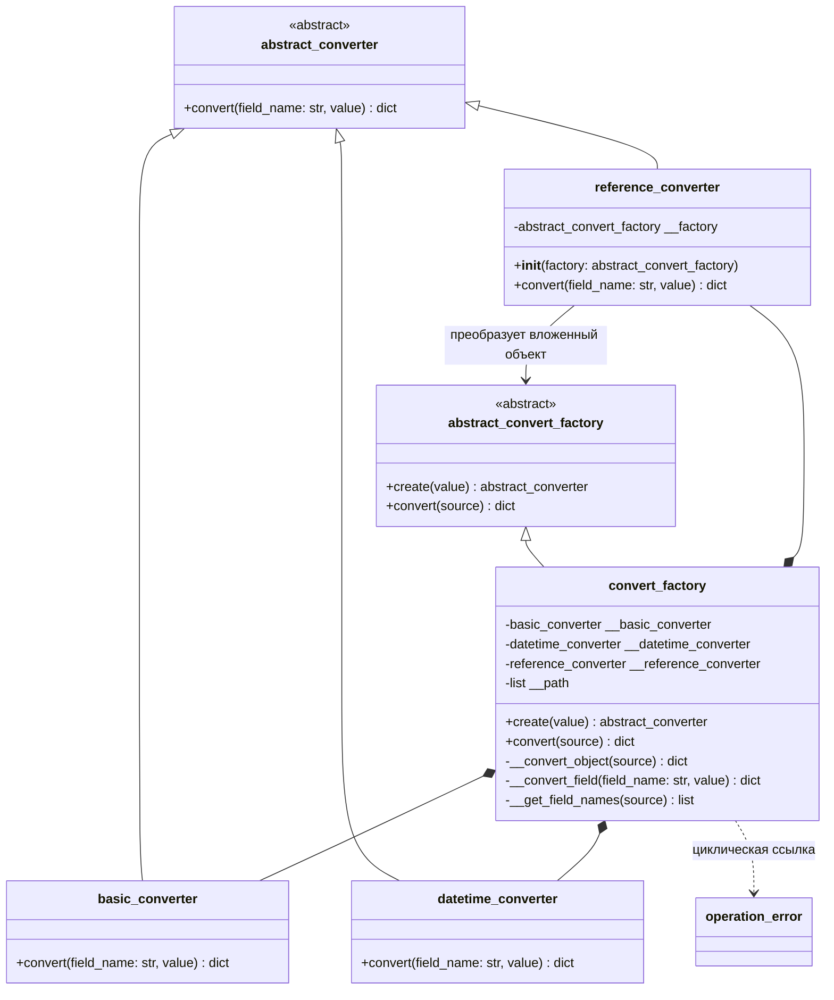
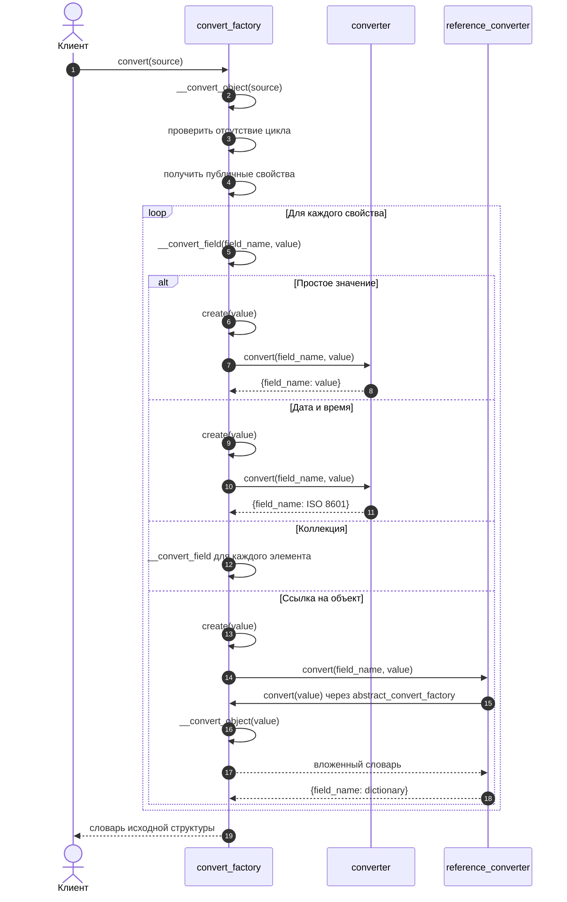

# UML-диаграммы конвертации объектов

## Диаграмма классов

```mermaid
classDiagram
    direction TB

    class abstract_converter {
        <<abstract>>
        +convert(field_name: str, value) dict
    }

    class abstract_convert_factory {
        <<abstract>>
        +create(value) abstract_converter
        +convert(source) dict
    }

    class basic_converter {
        +convert(field_name: str, value) dict
    }

    class datetime_converter {
        +convert(field_name: str, value) dict
    }

    class reference_converter {
        -abstract_convert_factory __factory
        +__init__(factory: abstract_convert_factory)
        +convert(field_name: str, value) dict
    }

    class convert_factory {
        -basic_converter __basic_converter
        -datetime_converter __datetime_converter
        -reference_converter __reference_converter
        -list __path
        +create(value) abstract_converter
        +convert(source) dict
        -__convert_object(source) dict
        -__convert_field(field_name: str, value) dict
        -__get_field_names(source) list
    }

    class operation_error

    abstract_converter <|-- basic_converter
    abstract_converter <|-- datetime_converter
    abstract_converter <|-- reference_converter
    abstract_convert_factory <|-- convert_factory

    convert_factory *-- basic_converter
    convert_factory *-- datetime_converter
    convert_factory *-- reference_converter
    reference_converter --> abstract_convert_factory : преобразует вложенный объект
    convert_factory ..> operation_error : циклическая ссылка
```

## Последовательность конвертации

```mermaid
sequenceDiagram
    autonumber
    actor Client as Клиент
    participant Factory as convert_factory
    participant Converter as converter
    participant Reference as reference_converter

    Client->>Factory: convert(source)
    Factory->>Factory: __convert_object(source)
    Factory->>Factory: проверить отсутствие цикла
    Factory->>Factory: получить публичные свойства

    loop Для каждого свойства
        Factory->>Factory: __convert_field(field_name, value)

        alt Простое значение
            Factory->>Factory: create(value)
            Factory->>Converter: convert(field_name, value)
            Converter-->>Factory: {field_name: value}
        else Дата и время
            Factory->>Factory: create(value)
            Factory->>Converter: convert(field_name, value)
            Converter-->>Factory: {field_name: ISO 8601}
        else Коллекция
            Factory->>Factory: __convert_field для каждого элемента
        else Ссылка на объект
            Factory->>Factory: create(value)
            Factory->>Reference: convert(field_name, value)
            Reference->>Factory: convert(value) через abstract_convert_factory
            Factory->>Factory: __convert_object(value)
            Factory-->>Reference: вложенный словарь
            Reference-->>Factory: {field_name: dictionary}
        end
    end

    Factory-->>Client: словарь исходной структуры
```
