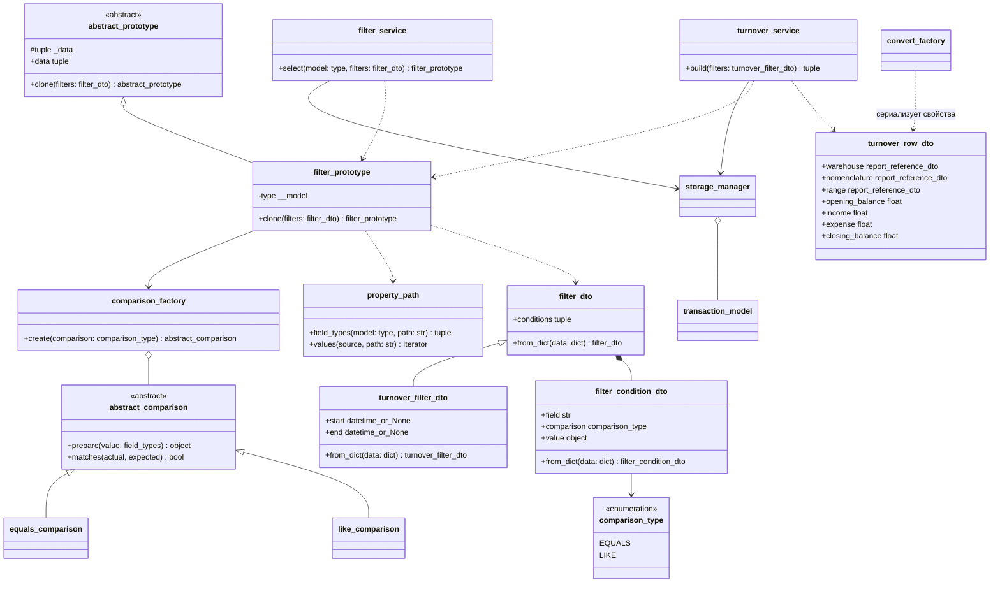
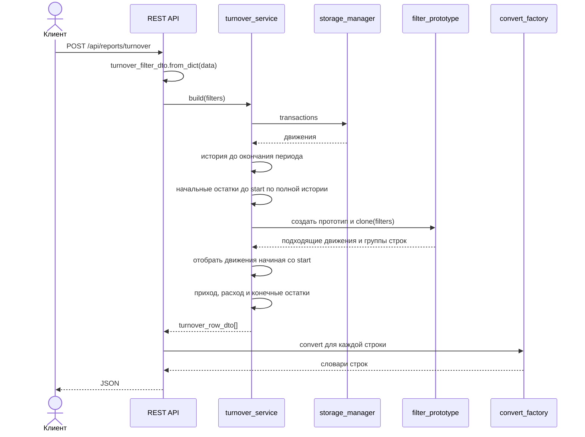

# Фильтрация и оборотно-сальдовая ведомость

## Диаграмма классов

```mermaid
classDiagram
    class abstract_prototype {
        <<abstract>>
        #tuple _data
        +data tuple
        +clone(filters: filter_dto) abstract_prototype
    }
    class filter_prototype {
        -type __model
        +clone(filters: filter_dto) filter_prototype
    }
    class filter_dto {
        +from_dict(data: dict) filter_dto
        +conditions tuple
    }
    class filter_condition_dto {
        +from_dict(data: dict) filter_condition_dto
        +field str
        +comparison comparison_type
        +value object
    }
    class turnover_filter_dto {
        +from_dict(data: dict) turnover_filter_dto
        +start datetime_or_None
        +end datetime_or_None
    }
    class comparison_type {
        <<enumeration>>
        EQUALS
        LIKE
    }
    class abstract_comparison {
        <<abstract>>
        +prepare(value, field_types) object
        +matches(actual, expected) bool
    }
    class equals_comparison
    class like_comparison
    class comparison_factory {
        +create(comparison: comparison_type) abstract_comparison
    }
    class property_path {
        +field_types(model: type, path: str) tuple
        +values(source, path: str) Iterator
    }
    class filter_service {
        +select(model: type, filters: filter_dto) filter_prototype
    }
    class turnover_service {
        +build(filters: turnover_filter_dto) tuple
    }
    class turnover_row_dto {
        +warehouse report_reference_dto
        +nomenclature report_reference_dto
        +range report_reference_dto
        +opening_balance float
        +income float
        +expense float
        +closing_balance float
    }
    class storage_manager
    class transaction_model
    class convert_factory

    abstract_prototype <|-- filter_prototype
    filter_dto <|-- turnover_filter_dto
    filter_dto *-- filter_condition_dto
    filter_condition_dto --> comparison_type
    abstract_comparison <|-- equals_comparison
    abstract_comparison <|-- like_comparison
    comparison_factory o-- abstract_comparison
    filter_prototype --> comparison_factory
    filter_prototype ..> property_path
    filter_prototype ..> filter_dto
    filter_service --> storage_manager
    filter_service ..> filter_prototype
    turnover_service --> storage_manager
    turnover_service ..> filter_prototype
    turnover_service ..> turnover_row_dto
    storage_manager o-- transaction_model
    convert_factory ..> turnover_row_dto : сериализует свойства
```

## Последовательность формирования ОСВ

```mermaid
sequenceDiagram
    actor Client as Клиент
    participant API as REST API
    participant Service as turnover_service
    participant Storage as storage_manager
    participant Prototype as filter_prototype
    participant Serializer as convert_factory

    Client->>API: POST /api/reports/turnover
    API->>API: turnover_filter_dto.from_dict(data)
    API->>Service: build(filters)
    Service->>Storage: transactions
    Storage-->>Service: движения
    Service->>Service: история до окончания периода
    Service->>Service: начальные остатки до start по полной истории
    Service->>Prototype: создать прототип и clone(filters)
    Prototype-->>Service: подходящие движения и группы строк
    Service->>Service: отобрать движения начиная со start
    Service->>Service: приход, расход и конечные остатки
    Service-->>API: turnover_row_dto[]
    API->>Serializer: convert для каждой строки
    Serializer-->>API: словари строк
    API-->>Client: JSON
```
