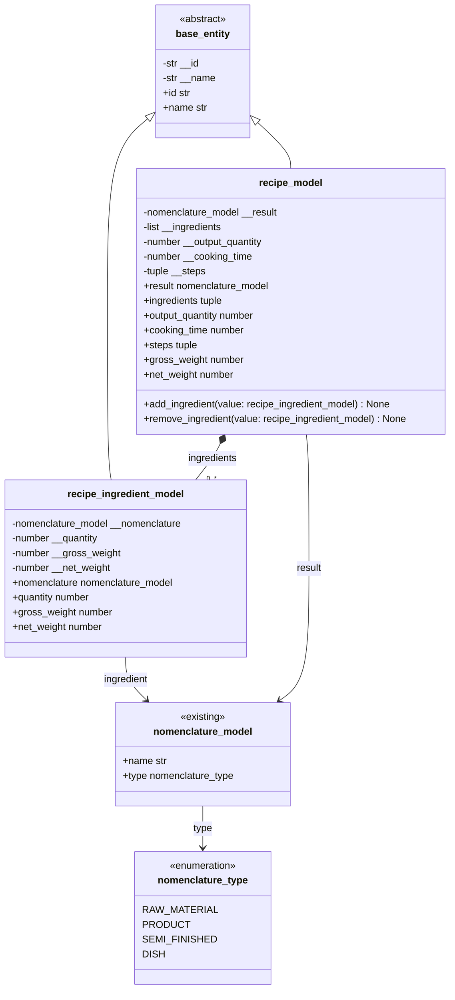

# UML-диаграммы технологической карты

## Диаграмма классов

```mermaid
classDiagram
    direction TB

    class base_entity {
        <<abstract>>
        -str __id
        -str __name
        +id str
        +name str
    }

    class nomenclature_model {
        <<existing>>
        +name str
        +type nomenclature_type
    }

    class nomenclature_type {
        <<enumeration>>
        RAW_MATERIAL
        PRODUCT
        SEMI_FINISHED
        DISH
    }

    class recipe_ingredient_model {
        -nomenclature_model __nomenclature
        -number __quantity
        -number __gross_weight
        -number __net_weight
        +nomenclature nomenclature_model
        +quantity number
        +gross_weight number
        +net_weight number
    }

    class recipe_model {
        -nomenclature_model __result
        -list __ingredients
        -number __output_quantity
        -number __cooking_time
        -tuple __steps
        +result nomenclature_model
        +ingredients tuple
        +output_quantity number
        +cooking_time number
        +steps tuple
        +gross_weight number
        +net_weight number
        +add_ingredient(value: recipe_ingredient_model) None
        +remove_ingredient(value: recipe_ingredient_model) None
    }

    base_entity <|-- recipe_ingredient_model
    base_entity <|-- recipe_model

    recipe_ingredient_model --> nomenclature_model : ingredient
    recipe_model --> nomenclature_model : result
    recipe_model *-- "0..*" recipe_ingredient_model : ingredients
    nomenclature_model --> nomenclature_type : type
```
