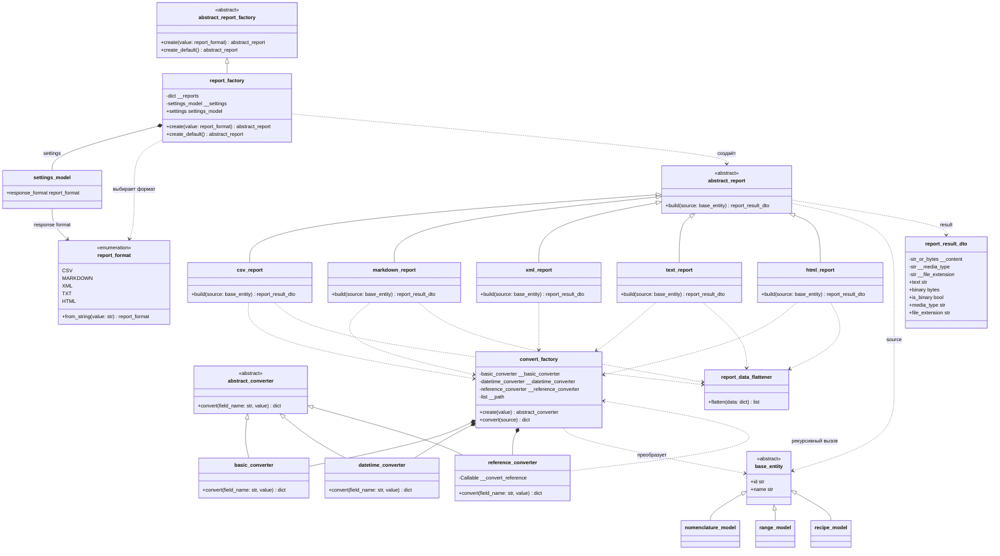
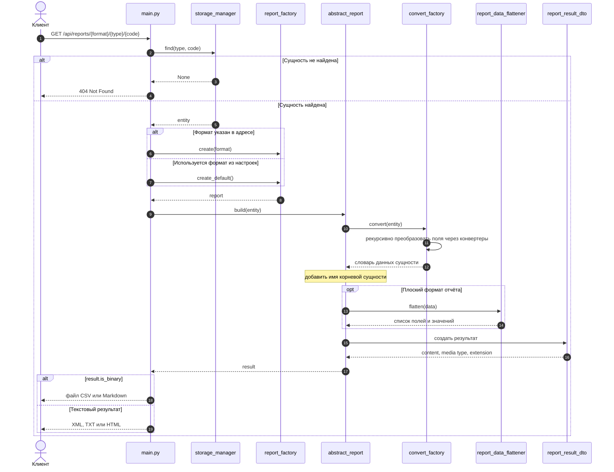

# UML-диаграммы формирования отчётов

## Диаграмма классов

```mermaid
classDiagram
    direction TB

    class abstract_report_factory {
        <<abstract>>
        +create(value: report_format) abstract_report
        +create_default() abstract_report
    }

    class report_factory {
        -dict __reports
        -settings_model __settings
        +settings settings_model
        +create(value: report_format) abstract_report
        +create_default() abstract_report
    }

    class abstract_report {
        <<abstract>>
        +build(source: base_entity) report_result_dto
    }

    class csv_report {
        +build(source: base_entity) report_result_dto
    }

    class markdown_report {
        +build(source: base_entity) report_result_dto
    }

    class xml_report {
        +build(source: base_entity) report_result_dto
    }

    class text_report {
        +build(source: base_entity) report_result_dto
    }

    class html_report {
        +build(source: base_entity) report_result_dto
    }

    class report_result_dto {
        -str_or_bytes __content
        -str __media_type
        -str __file_extension
        +text str
        +binary bytes
        +is_binary bool
        +media_type str
        +file_extension str
    }

    class abstract_converter {
        <<abstract>>
        +convert(field_name: str, value) dict
    }

    class basic_converter {
        +convert(field_name: str, value) dict
    }

    class datetime_converter {
        +convert(field_name: str, value) dict
    }

    class reference_converter {
        -Callable __convert_reference
        +convert(field_name: str, value) dict
    }

    class convert_factory {
        -basic_converter __basic_converter
        -datetime_converter __datetime_converter
        -reference_converter __reference_converter
        -list __path
        +create(value) abstract_converter
        +convert(source) dict
    }

    class report_data_flattener {
        +flatten(data: dict) list
    }

    class report_format {
        <<enumeration>>
        CSV
        MARKDOWN
        XML
        TXT
        HTML
        +from_string(value: str) report_format
    }

    class settings_model {
        +response_format report_format
    }

    class base_entity {
        <<abstract>>
        +id str
        +name str
    }

    class nomenclature_model
    class range_model
    class recipe_model

    abstract_report_factory <|-- report_factory
    abstract_report <|-- csv_report
    abstract_report <|-- markdown_report
    abstract_report <|-- xml_report
    abstract_report <|-- text_report
    abstract_report <|-- html_report

    report_factory *-- settings_model : settings
    report_factory ..> report_format : выбирает формат
    report_factory ..> abstract_report : создаёт
    settings_model --> report_format : response format

    abstract_report ..> base_entity : source
    abstract_report ..> report_result_dto : result
    csv_report ..> convert_factory
    markdown_report ..> convert_factory
    xml_report ..> convert_factory
    text_report ..> convert_factory
    html_report ..> convert_factory
    csv_report ..> report_data_flattener
    markdown_report ..> report_data_flattener
    text_report ..> report_data_flattener
    html_report ..> report_data_flattener

    abstract_converter <|-- basic_converter
    abstract_converter <|-- datetime_converter
    abstract_converter <|-- reference_converter
    convert_factory *-- basic_converter
    convert_factory *-- datetime_converter
    convert_factory *-- reference_converter
    reference_converter ..> convert_factory : рекурсивный вызов

    base_entity <|-- nomenclature_model
    base_entity <|-- range_model
    base_entity <|-- recipe_model
    convert_factory ..> base_entity : преобразует
```

## Последовательность формирования отчёта

```mermaid
sequenceDiagram
    autonumber
    actor Client as Клиент
    participant API as main.py
    participant Storage as storage_manager
    participant Factory as report_factory
    participant Report as abstract_report
    participant ConvertFactory as convert_factory
    participant Flattener as report_data_flattener
    participant Result as report_result_dto

    Client->>API: GET /api/reports/{format}/{type}/{code}
    API->>Storage: find(type, code)

    alt Сущность не найдена
        Storage-->>API: None
        API-->>Client: 404 Not Found
    else Сущность найдена
        Storage-->>API: entity

        alt Формат указан в адресе
            API->>Factory: create(format)
        else Используется формат из настроек
            API->>Factory: create_default()
        end

        Factory-->>API: report
        API->>Report: build(entity)
        Report->>ConvertFactory: convert(entity)
        ConvertFactory->>ConvertFactory: рекурсивно преобразовать поля через конвертеры
        ConvertFactory-->>Report: словарь данных сущности
        Note over Report: добавить имя корневой сущности
        opt Плоский формат отчёта
            Report->>Flattener: flatten(data)
            Flattener-->>Report: список полей и значений
        end
        Report->>Result: создать результат
        Result-->>Report: content, media type, extension
        Report-->>API: result

        alt result.is_binary
            API-->>Client: файл CSV или Markdown
        else Текстовый результат
            API-->>Client: XML, TXT или HTML
        end
    end
```
