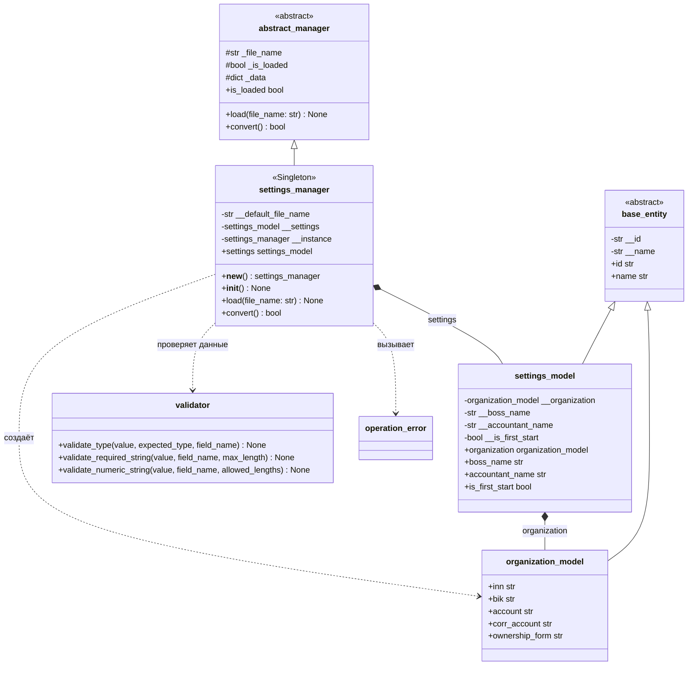
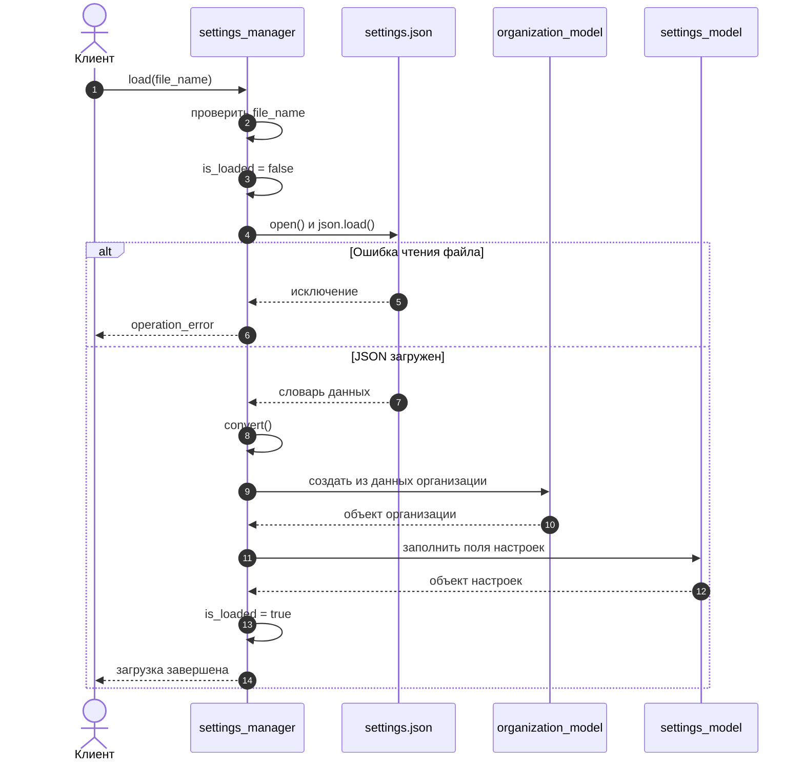

# UML-диаграммы менеджера настроек

## Диаграмма классов

```mermaid
classDiagram
    direction TB

    class abstract_manager {
        <<abstract>>
        #str _file_name
        #bool _is_loaded
        #dict _data
        +load(file_name: str) None
        +convert() bool
        +is_loaded bool
    }

    class settings_manager {
        <<Singleton>>
        -str __default_file_name
        -settings_model __settings
        -settings_manager __instance
        +__new__() settings_manager
        +__init__() None
        +load(file_name: str) None
        +convert() bool
        +settings settings_model
    }

    class base_entity {
        <<abstract>>
        -str __id
        -str __name
        +id str
        +name str
    }

    class settings_model {
        -organization_model __organization
        -str __boss_name
        -str __accountant_name
        -bool __is_first_start
        +organization organization_model
        +boss_name str
        +accountant_name str
        +is_first_start bool
    }

    class organization_model {
        +inn str
        +bik str
        +account str
        +corr_account str
        +ownership_form str
    }

    class validator {
        +validate_type(value, expected_type, field_name) None
        +validate_required_string(value, field_name, max_length) None
        +validate_numeric_string(value, field_name, allowed_lengths) None
    }

    class operation_error

    abstract_manager <|-- settings_manager
    base_entity <|-- settings_model
    base_entity <|-- organization_model
    settings_manager *-- settings_model : settings
    settings_model *-- organization_model : organization
    settings_manager ..> organization_model : создаёт
    settings_manager ..> validator : проверяет данные
    settings_manager ..> operation_error : вызывает
```

## Последовательность загрузки настроек

```mermaid
sequenceDiagram
    autonumber
    actor Client as Клиент
    participant Manager as settings_manager
    participant File as settings.json
    participant Organization as organization_model
    participant Settings as settings_model

    Client->>Manager: load(file_name)
    Manager->>Manager: проверить file_name
    Manager->>Manager: is_loaded = false
    Manager->>File: open() и json.load()

    alt Ошибка чтения файла
        File-->>Manager: исключение
        Manager-->>Client: operation_error
    else JSON загружен
        File-->>Manager: словарь данных
        Manager->>Manager: convert()
        Manager->>Organization: создать из данных организации
        Organization-->>Manager: объект организации
        Manager->>Settings: заполнить поля настроек
        Settings-->>Manager: объект настроек
        Manager->>Manager: is_loaded = true
        Manager-->>Client: загрузка завершена
    end
```
