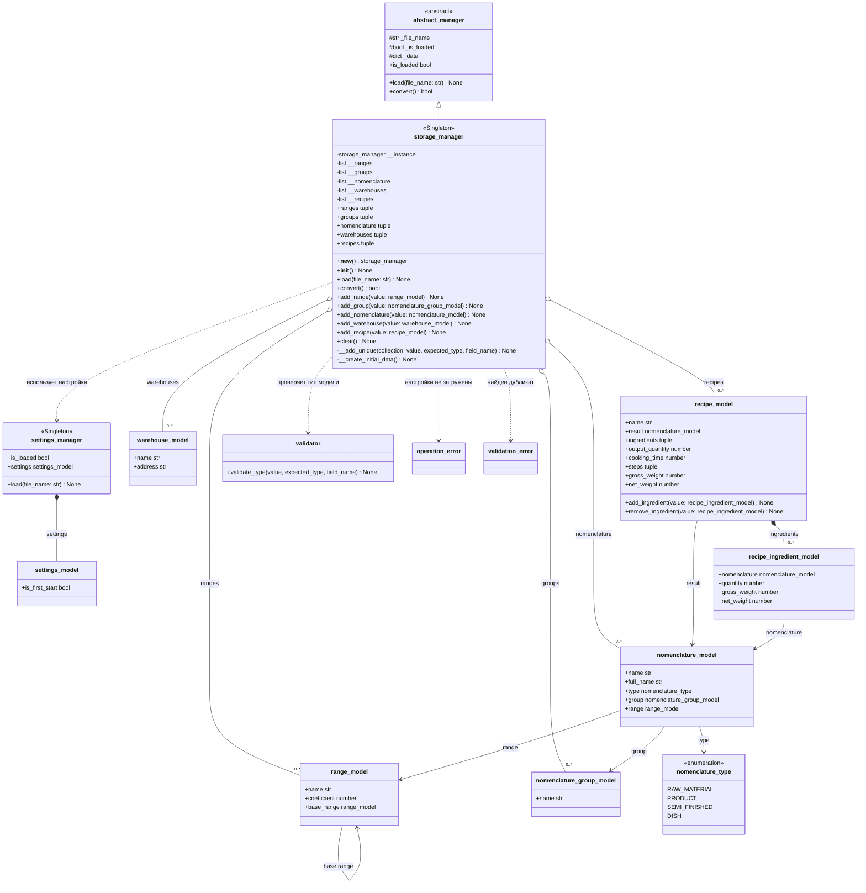
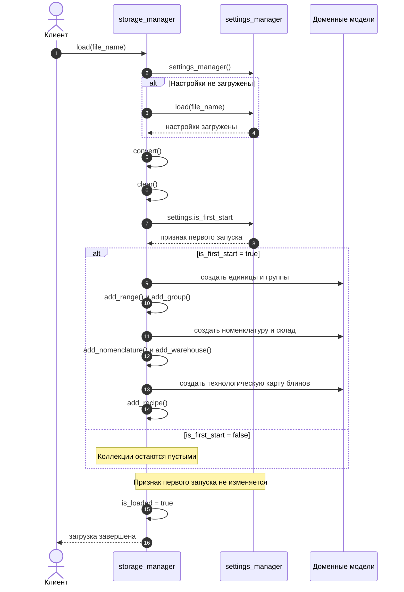

# UML-диаграммы менеджера хранилища

## Диаграмма классов

```mermaid
classDiagram
    direction TB

    class abstract_manager {
        <<abstract>>
        #str _file_name
        #bool _is_loaded
        #dict _data
        +load(file_name: str) None
        +convert() bool
        +is_loaded bool
    }

    class storage_manager {
        <<Singleton>>
        -storage_manager __instance
        -list __ranges
        -list __groups
        -list __nomenclature
        -list __warehouses
        -list __recipes
        +__new__() storage_manager
        +__init__() None
        +load(file_name: str) None
        +convert() bool
        +add_range(value: range_model) None
        +add_group(value: nomenclature_group_model) None
        +add_nomenclature(value: nomenclature_model) None
        +add_warehouse(value: warehouse_model) None
        +add_recipe(value: recipe_model) None
        +clear() None
        +ranges tuple
        +groups tuple
        +nomenclature tuple
        +warehouses tuple
        +recipes tuple
        -__add_unique(collection, value, expected_type, field_name) None
        -__create_initial_data() None
    }

    class settings_manager {
        <<Singleton>>
        +load(file_name: str) None
        +is_loaded bool
        +settings settings_model
    }

    class settings_model {
        +is_first_start bool
    }

    class range_model {
        +name str
        +coefficient number
        +base_range range_model
    }

    class nomenclature_group_model {
        +name str
    }

    class nomenclature_model {
        +name str
        +full_name str
        +type nomenclature_type
        +group nomenclature_group_model
        +range range_model
    }

    class nomenclature_type {
        <<enumeration>>
        RAW_MATERIAL
        PRODUCT
        SEMI_FINISHED
        DISH
    }

    class warehouse_model {
        +name str
        +address str
    }

    class recipe_ingredient_model {
        +nomenclature nomenclature_model
        +quantity number
        +gross_weight number
        +net_weight number
    }

    class recipe_model {
        +name str
        +result nomenclature_model
        +ingredients tuple
        +output_quantity number
        +cooking_time number
        +steps tuple
        +gross_weight number
        +net_weight number
        +add_ingredient(value: recipe_ingredient_model) None
        +remove_ingredient(value: recipe_ingredient_model) None
    }

    class validator {
        +validate_type(value, expected_type, field_name) None
    }

    class operation_error
    class validation_error

    abstract_manager <|-- storage_manager
    storage_manager ..> settings_manager : использует настройки
    settings_manager *-- settings_model : settings
    storage_manager o-- "0..*" range_model : ranges
    storage_manager o-- "0..*" nomenclature_group_model : groups
    storage_manager o-- "0..*" nomenclature_model : nomenclature
    storage_manager o-- "0..*" warehouse_model : warehouses
    storage_manager o-- "0..*" recipe_model : recipes
    nomenclature_model --> nomenclature_group_model : group
    nomenclature_model --> range_model : range
    nomenclature_model --> nomenclature_type : type
    recipe_model *-- "0..*" recipe_ingredient_model : ingredients
    recipe_model --> nomenclature_model : result
    recipe_ingredient_model --> nomenclature_model : nomenclature
    range_model --> range_model : base range
    storage_manager ..> validator : проверяет тип модели
    storage_manager ..> operation_error : настройки не загружены
    storage_manager ..> validation_error : найден дубликат
```

## Последовательность подготовки хранилища

```mermaid
sequenceDiagram
    autonumber
    actor Client as Клиент
    participant Storage as storage_manager
    participant Settings as settings_manager
    participant Models as Доменные модели

    Client->>Storage: load(file_name)
    Storage->>Settings: settings_manager()

    alt Настройки не загружены
        Storage->>Settings: load(file_name)
        Settings-->>Storage: настройки загружены
    end

    Storage->>Storage: convert()
    Storage->>Storage: clear()
    Storage->>Settings: settings.is_first_start
    Settings-->>Storage: признак первого запуска

    alt is_first_start = true
        Storage->>Models: создать единицы и группы
        Storage->>Storage: add_range() и add_group()
        Storage->>Models: создать номенклатуру и склад
        Storage->>Storage: add_nomenclature() и add_warehouse()
        Storage->>Models: создать технологическую карту блинов
        Storage->>Storage: add_recipe()
    else is_first_start = false
        Note over Storage: Коллекции остаются пустыми
    end

    Note over Storage,Settings: Признак первого запуска не изменяется
    Storage->>Storage: is_loaded = true
    Storage-->>Client: загрузка завершена
```
